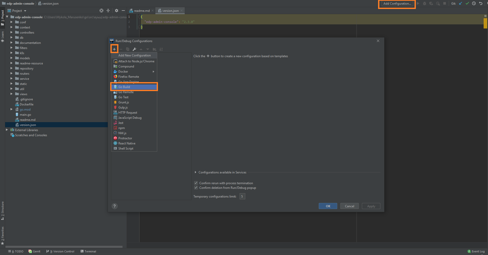

# How to Install Operator

EDP installation can be applied on two container orchestration platforms: OpenShift and Kubernetes.

_**NOTE:** Installation of operators is platform-independent, that is why there is a unified instruction for deploying._


### Prerequisites
1. Linux machine or Windows Subsystem for Linux instance with [kubectl](https://kubernetes.io/docs/tasks/tools/install-kubectl/) installed with an authorized access to the cluster;
2. Admin space is deployed by following one of the instructions: [edp-install-openshift](https://github.com/epmd-edp/edp-install/blob/master/documentation/openshift_install.md#admin-space) or [edp-install-kubernetes](https://github.com/epmd-edp/edp-install/blob/master/documentation/kubernetes_install.md#admin-space).

### Installation
* Go to the [releases](https://github.com/epmd-edp/sonar-operator/releases) page of this repository, choose a version, download an archive and unzip it;

_**NOTE:** It is highly recommended to use the latest released version._

* Go to the unzipped directory and apply all files with the Custom Resource Definitions resource:
```bash
for file in $(ls deploy/crds/*_crd.yaml); do kubectl apply -f $file; done
```

* Deploy operator:
```bash
kubectl patch -n <edp_cicd_project> -f deploy/operator.yaml --local=true --patch='{"spec":{"template":{"spec":{"containers":[{"image":"epamedp/sonar-operator:<operator_version>", "name":"sonar-operator-v2", "env": [{"name":"WATCH_NAMESPACE", "value":"<edp_cicd_project>"}, {"name":"PLATFORM_TYPE","value":"kubernetes"}]}]}}}}' -o yaml | kubectl -n <edp_cicd_project> apply -f -
```

- _<operator_version> - a selected release version;_

- _<edp_cicd_project> - a namespace or a project name (in case of OpenSift) that is created by one of the instructions: [edp-install-openshift](https://github.com/epmd-edp/edp-install/blob/master/documentation/openshift_install.md#install-edp) or [edp-install-kubernetes](https://github.com/epmd-edp/edp-install/blob/master/documentation/kubernetes_install.md#install-edp);_

- _<platform_type> - a platform type that can be "kubernetes" or "openshift"_.

* Check the <edp_cicd_project> namespace that should contain Deployment with your operator in a running status.

## Local deployment
### Requirements:
* Go version (great than 1.13)

_**NOTE**: Make sure that environment variable GOPATH and GOROOT are added in PATH:_
```
export GOPATH=C:\Users\<<username>>\go
export GOROOT=C:\Go
```

* Configured access to the VCS (see [Gerrit Setup for Developer](https://kb.epam.com/display/EPMDEDP/Gerrit+Setup+for+Developer))
* GoLand Intellij Idea or another IDE

### Deploy:
1. Clone repository
2. Open folder in GoLand Intellij Idea and select Add Configuration → Go Build
 
3. Set the path to the main.go file in Files field and path to the Working directory for operator
 
4. Specify a platform name (OpenShift/Kubernetes) and selected namespace in Environment tab 
 
5. Run 'go build main.go' (Shift+F10)
6. Check the operator logs in output console 
```
{"level":"info","ts":1580820956.2087429,"logger":"cmd","msg":"Go Version: go1.13.7"}
{"level":"info","ts":1580820956.2087429,"logger":"cmd","msg":"Go OS/Arch: windows/amd64"}
{"level":"info","ts":1580820956.2087429,"logger":"cmd","msg":"Version of operator-sdk: v0.8.0+git"}
{"level":"info","ts":1580820956.2087429,"logger":"cmd","msg":""}
{"level":"info","ts":1580820959.592205,"logger":"cmd","msg":"Registering Components."}
{"level":"info","ts":1580820959.592205,"logger":"kubebuilder.controller","msg":"Starting EventSource","controller":"codebase-controller","source":"kind source: /, Kind="}
{"level":"info","ts":1580820959.592205,"logger":"kubebuilder.controller","msg":"Starting EventSource","controller":"codebasebranch-controller","source":"kind source: /, Kind="}
2020/02/04 14:55:59 Openshift clients was successfully created
{"level":"info","ts":1580820959.608795,"logger":"kubebuilder.controller","msg":"Starting EventSource","controller":"gitserver-controller","source":"kind source: /, Kind="}
{"level":"info","ts":1580820959.608795,"logger":"cmd","msg":"Starting the Cmd."}
```

### Exceptional Cases
After starting Go build process you see the following error: 
```
go: finding github.com/openshift/api v3.9.0
go: finding github.com/openshift/client-go v3.9.0
go: errors parsing go.mod:
C:\Users\<<username>>\Desktop\EDP\edp-admin-console\go.mod:36: require github.com/openshift/api: version "v3.9.0" invalid: unknown revision v3.9.0

Compilation finished with exit code 1
```

This problem can resolve by manual update go dependency using golang command:
```
go get github.com/openshift/api@v3.9.0
```