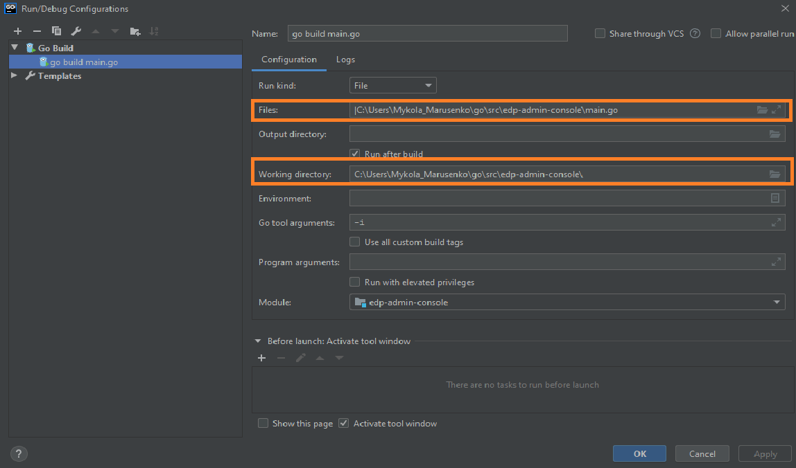

## Local development
### Requirements:
* Go version (great than 1.13)

_**NOTE**: Make sure that environment variable GOPATH and GOROOT are added in PATH:_
```
export GOPATH=C:\Users\<<username>>\go
export GOROOT=C:\Go
```

* Configured access to the VCS (see [Gerrit Setup for Developer](https://kb.epam.com/display/EPMDEDP/Gerrit+Setup+for+Developer))
* GoLand Intellij Idea or another IDE

### Running the operator:
1. Clone repository
2. Open folder in GoLand Intellij Idea and select Add Configuration → Go Build
 
3. Set the path to the main.go file in Files field and path to the Working directory for operator
 
4. Specify a platform name (OpenShift/Kubernetes) and selected namespace in Environment tab 
 
5. Run ```go build main.go``` (Shift+F10)
6. Check the operator logs in output console 
```
{"level":"info","ts":1580911926.9410942,"logger":"cmd","msg":"Go Version: go1.13.7"}
{"level":"info","ts":1580911926.9410942,"logger":"cmd","msg":"Go OS/Arch: windows/amd64"}
{"level":"info","ts":1580911926.9410942,"logger":"cmd","msg":"Version of operator-sdk: v0.8.0+git"}
{"level":"info","ts":1580911926.9440217,"logger":"leader","msg":"Trying to become the leader."}
{"level":"info","ts":1580911926.9440217,"logger":"leader","msg":"Skipping leader election; not running in a cluster."}
{"level":"info","ts":1580911929.2100894,"logger":"cmd","msg":"Registering Components."}
{"level":"info","ts":1580911929.2110655,"logger":"kubebuilder.controller","msg":"Starting EventSource","controller":"sonar-controller","source":"kind source: /, Kind="}
{"level":"info","ts":1580911929.2110655,"logger":"cmd","msg":"Starting the Cmd."}
{"level":"info","ts":1580911929.3115437,"logger":"kubebuilder.controller","msg":"Starting Controller","controller":"sonar-controller"}
{"level":"info","ts":1580911929.4121592,"logger":"kubebuilder.controller","msg":"Starting workers","controller":"sonar-controller","worker count":1}
```

### Exceptional Cases
After starting Go build process you see the following error: 
```
go: finding github.com/openshift/api v3.9.0
go: finding github.com/openshift/client-go v3.9.0
go: errors parsing go.mod:
C:\Users\<<username>>\Desktop\EDP\edp-admin-console\go.mod:36: require github.com/openshift/api: version "v3.9.0" invalid: unknown revision v3.9.0

Compilation finished with exit code 1
```

This problem can resolve by manual update go dependency using golang command:
```
go get github.com/openshift/api@v3.9.0
```

In case if you have error: *Unauthorized* error in logs, check you current *KUBECONFIG* path.
You can specify another *KUBECONFIG* path before running operator in Go build configuration (see point 4):
```
WATCH_NAMESPACE=test-deploy-platform;PLATFORM_TYPE=openshift;KUBECONFIG=C:\Users\<<username>>\.kube\kubeconfig
```